# Treenikamu – Dokumentaatio

## 📑 Sisällysluettelo
- [Yleiskuvaus](#yleiskuvaus)
- [Käytetyt teknologiat](#käytetyt-teknologiat)
- [Sovelluksen toiminnot ja näkymät](#sovelluksen-toiminnot-ja-näkymät)
- [Tietokantarakenne](#tietokantarakenne)
- [Arkkitehtuuri ja projektirakenne](#arkkitehtuuri-ja-projektirakenne)
- [Lähteet](#lähteet)

---

# Yleiskuvaus

Treenikamu sovellus on kaikentasoisille kuntosaliliikkujille tarkoitettu apuväline, jonka avulla kuka tahansa voi aloittaa terveellisemmät elämäntavat! Treenikamun avulla voit luoda itsellesi treeniohjelman, johon saat lisättyä haluamiasi liikkeitä laajasta tietokannasta.
Jokaiset liikkeet ovat opastettuja ja jokaiselle liikkeelle voi erikseen valita sarjapainot/sarjat/toistot, jotta voit pitää kirjaa kehittymisestäsi.  


---


## Käytetyt teknologiat


<p align="center">
  <a href="https://skillicons.dev">
    
    
  </a>
</p>

<br/>

<details>
<summary>Käytetyt kirjastot ja riippuvuudet:</summary>


- expo/vector-icons
- react-navigation/native
- react-navigation/bottom-tabs
- react-native-community/slider
- react-native-picker/picker
- react-native-calendars
- react-native-async-storage/async-storage
- react-native-element-dropdown
- react-native-check-box
- react-native-config
- react-native-screens
- react-native-safe-area-context
- react-native-popup-menu
- react-native-vector-icons
- ionicons
- expofont

</details>


---

## Sovelluksen toiminnot ja näkymät


Kirjoita tähän lyhyet kuvaukset ja liitä halutessasi kuvakaappauksia:

<details>
<summary>Kirjautumisnäkymä</summary>

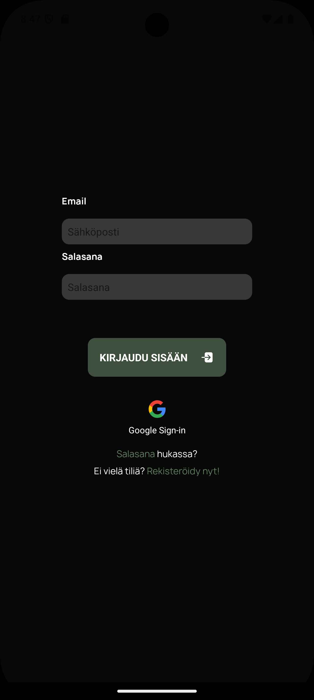
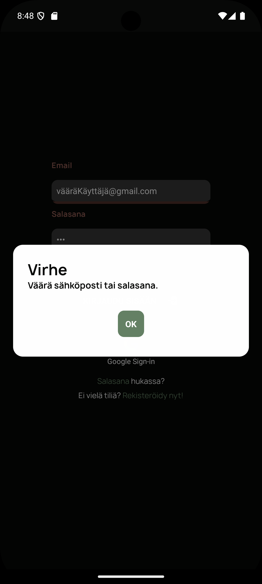

</details>
<details>
<summary>Rekisteröitymisnäkyä</summary>

## Rekisteröitymisnäkymä
Rekisteröitymisnäkymä koostuu kolmesta eri suoritettavasta lomakkeesta, jotka suoritettuaan käyttäjä voi rekisteröityä. 
 
<br/>
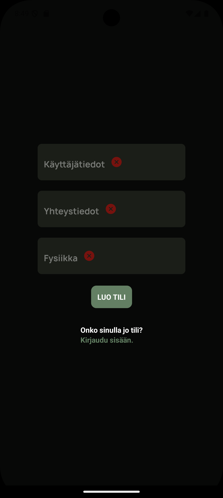
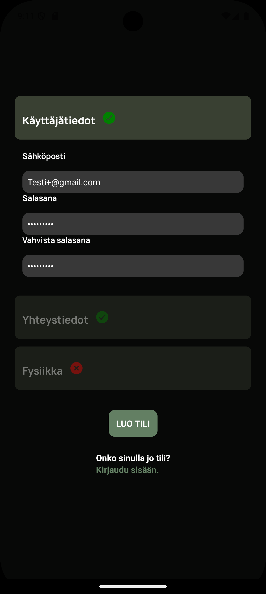
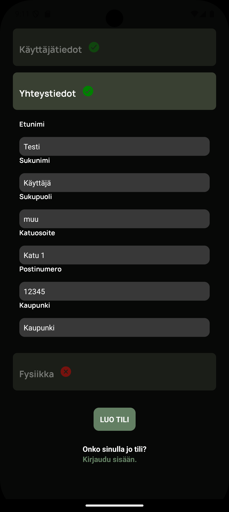
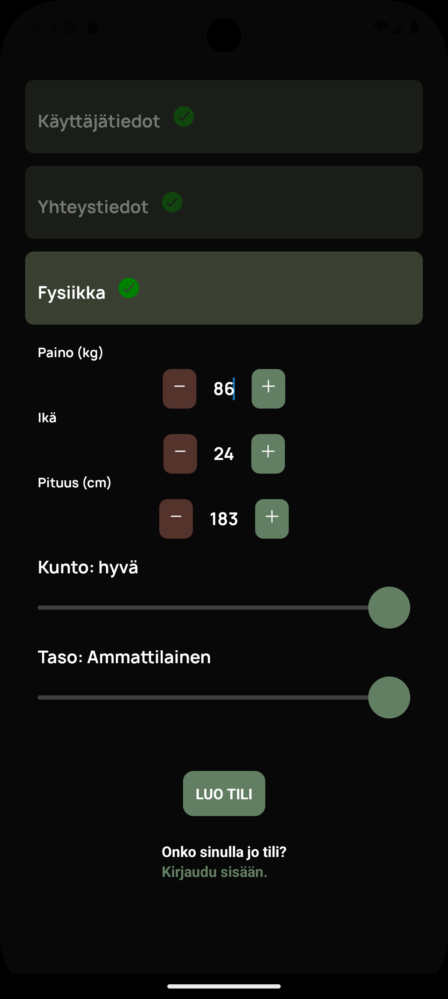

---


</details>
<details>
<summary>Etusivu</summary>

## Etusivu
Etusivulle tulee käyttäjän seuraavan treenin tiedot ja pikalinkit tilastotietoihin ja treeniohjelmaan

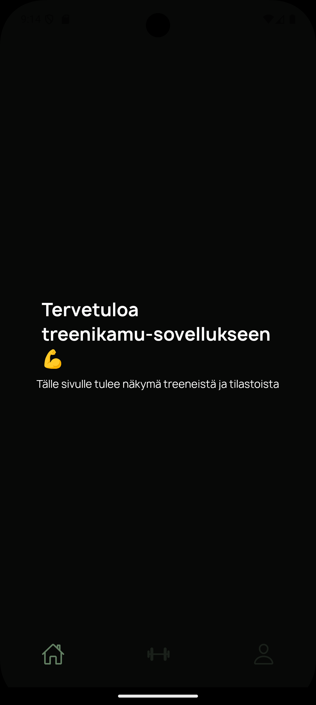

</details>
<details>
<summary>Treeniohjelman luonti</summary>

## Treeniohjelman luonit

Treeniohjelman voi luoda tällä hetkellä vain yhdellä tietyllä "splitillä", joka on kuvastettu näyttökuvassa. 

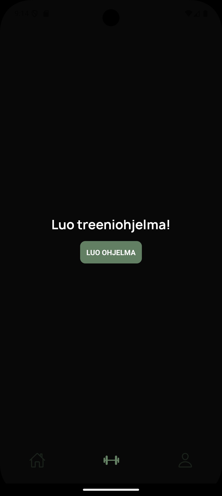


### Valitse treenipäivät
Treenipäivät kohdassa käyttäjä voi valita treenattavat päivät sekä kuinka useasti treenit toistetaan

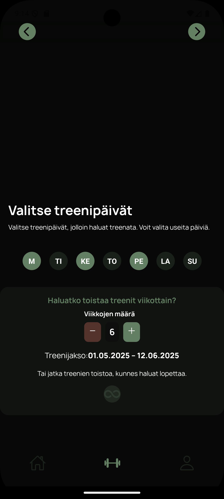
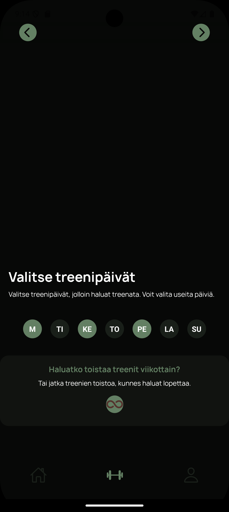

### Liikkeet
Tämä näkymä antaa käyttäjälle mahdollisuuden hallita treeniohjlmansa liikkeitä ennen ohjelman tallentamista. Liikkeitä voi klikata, jolloin käyttäjä näkee lisätietoja liikkeestä ja voi asettaa liikkeelle Toistomäärän, Sarjamääärän sekä Sarjapainot. Käyttäjä voi myös poistaa/lisätä liikkeitä treeniohjelmaansa. Tallenna-nappi tallentaa käyttäjän treeniohjelman tietokantaan ja ohjaa käyttäjän takaisin treeniohjelma-näkymään.

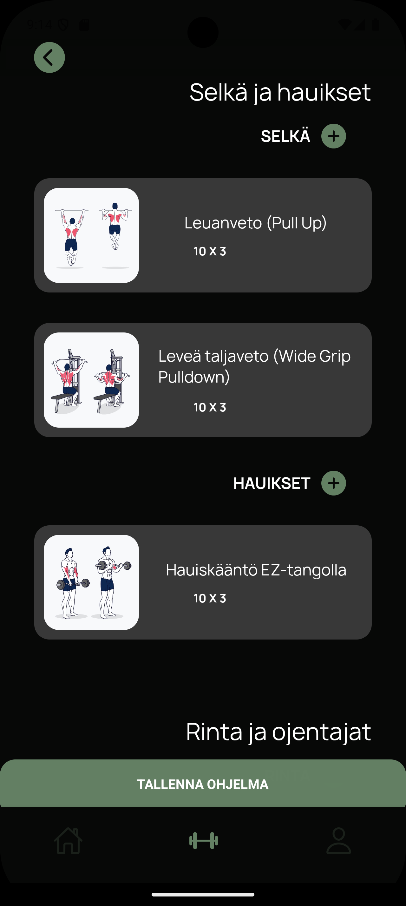
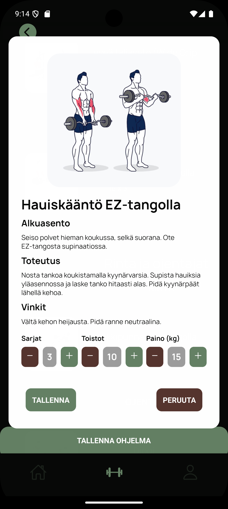
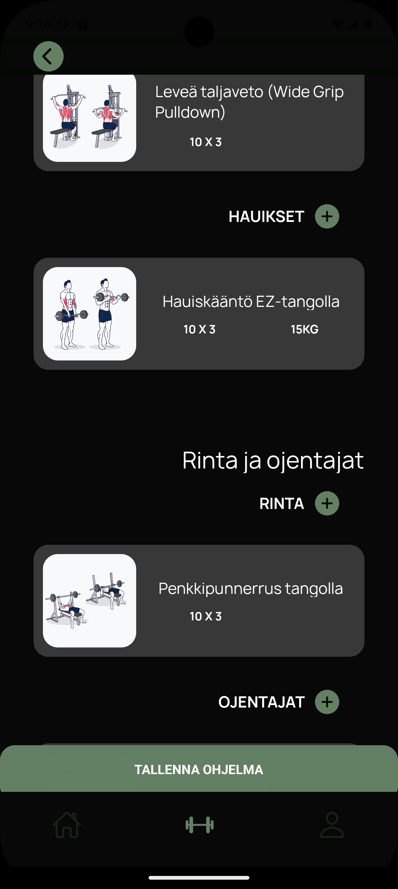
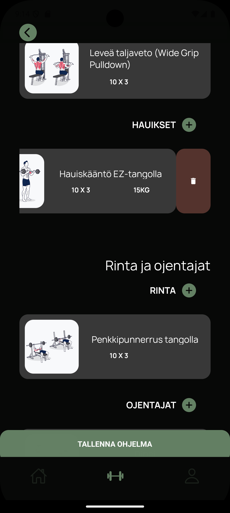
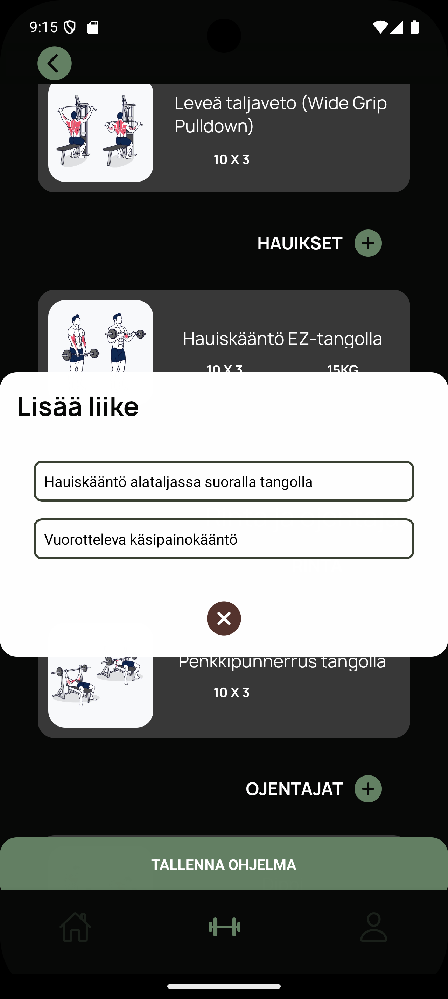


</details>
<details>
<summary>Treeniohjelma</summary>

### Tallennettu treeniohjelma
Tässä näkymässä on käyttäjän tallennettu treeniohjelma. Näkymässä voi toteuttaa samoja hallinnointiin liittyviä toimenpiteitä kuin treeniohjelman laatimisnäkymässä.

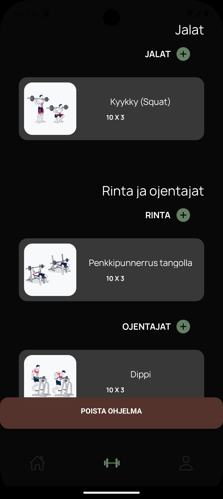
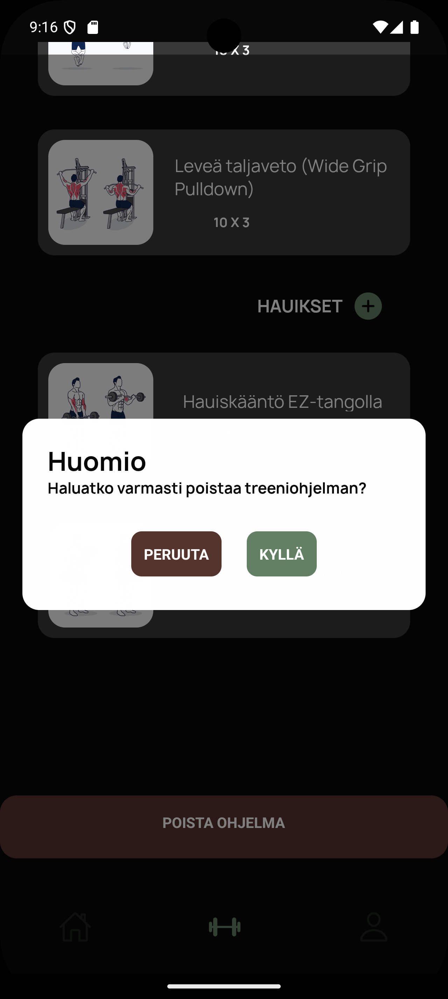
</details>
<details>
<summary>Profiilinäkymä</summary>

### Profiilinäkymä
Käyttäjä voi muokata tietojaan profiilinäkymässä rekisteröintilomakkeen tapaisesti.

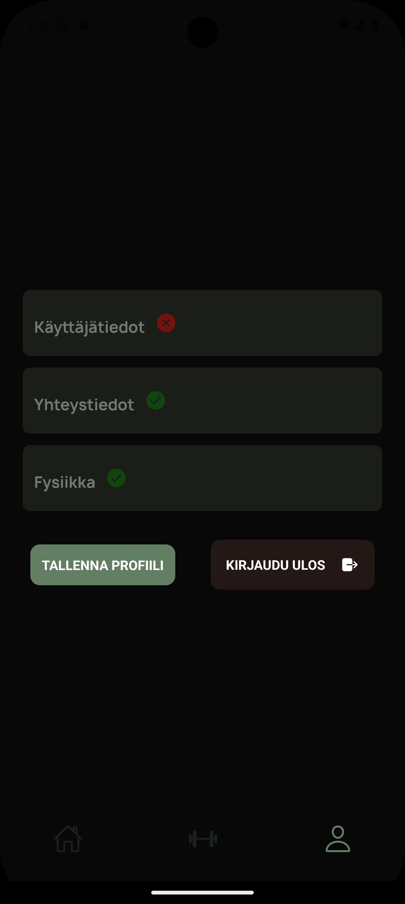
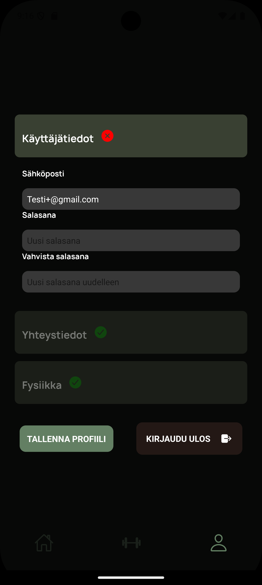
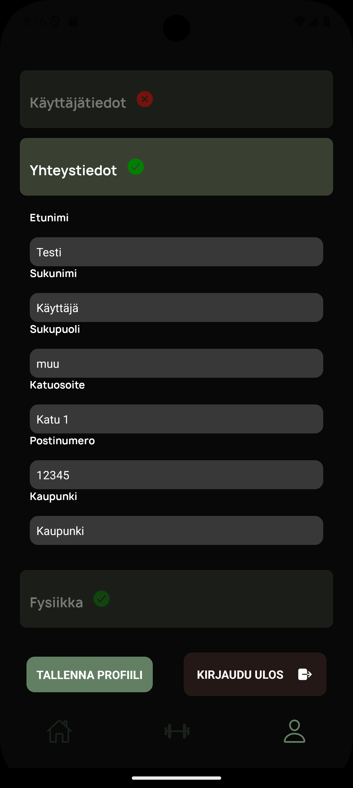
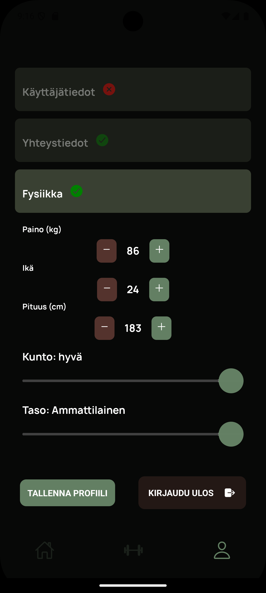

</details>


---

## Tietokantarakenne
### Tämä kappale on vielä kesken
Tietokanta on luotu käyttäen firebase realtime database- tietokantaa, joka on käytännössä suuri JSON-puu. Tietokantapalvelu tulee tulevaisuudessa vaihtumaan.

### Realtime database -rakenne

```
database/
    ├── liikkeet/
        ├── hauikset/
            ├── field/
            ├── field/
            ├── field/
            ├── field/
            ├── field/
            └── field/
        ├── jalat/
        ├── ojentajat/
        ├── olkapäät/
        ├── rinta/
        ├── selkä/
        └── vatsa/
    └── users/
        ├── user/
            ├── field/
            ├── field/
            ├── field/
            ├── field/
            ├── field/
            ├── field/
            └── workoutplan
                ├── days/
                    └── 
                └── blaa
 
```

---

## Arkkitehtuuri ja projektirakenne

### Tämä kappale on vielä kesken
<details>
<summary>Projektin hakemistorakenne ja arkkitehtuurikuvaus</summary>


```
root/
 ├── assets/
 ├── components/
 ├── configuration/
 ├── screens/
 ├── styles/
 └── App.js
```


</details>

---

# Lähteet

### Treeniliikkeet ja niiden kuvat

- [Free Illustrated Workout Exercise Guides - Simply Fitness](https://www.simplyfitness.com/pages/workout-exercise-guides)

# Keskeneräistä

// Käyttöohje


// Lisenssi

---

